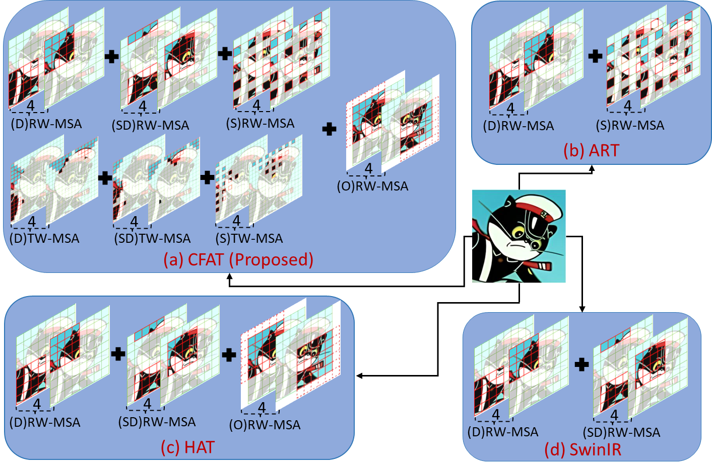
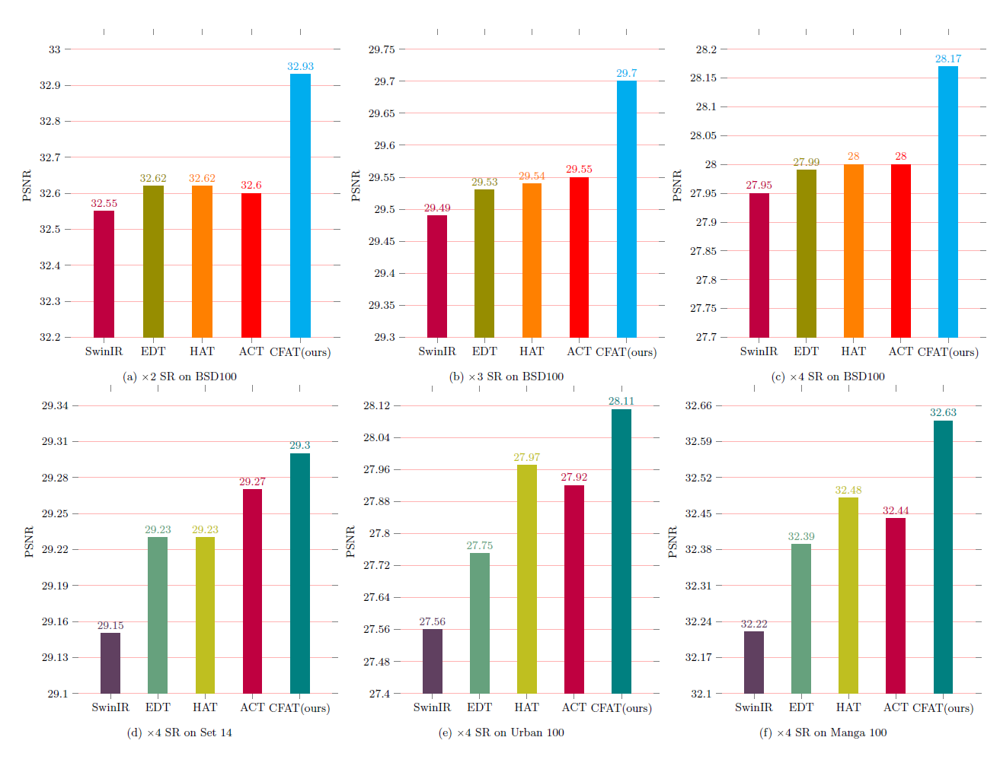
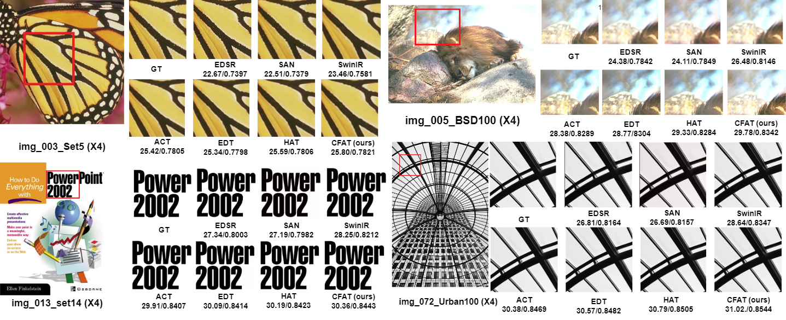
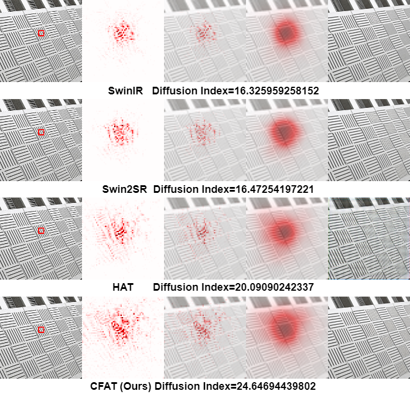
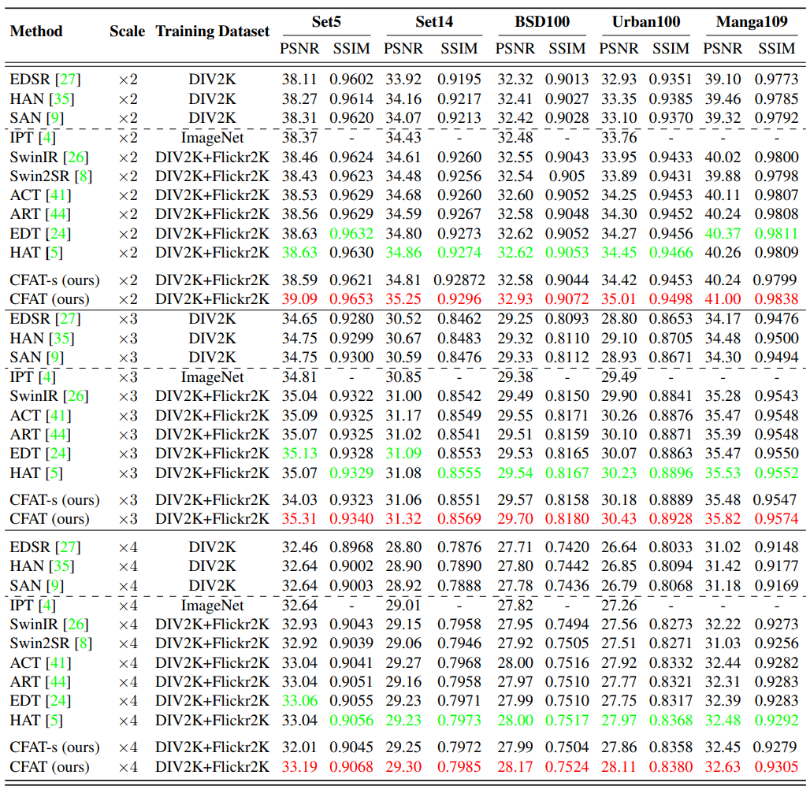

## [CVPR 2024] CFAT: Unleashing TriangularWindows for Image Super-resolution <p align="center">
<a href="https://arxiv.org/abs/2403.16143" alt="arXiv"></a></p>


[](https://github.com/rayabhisek123/CFAT)

[Abhisek Ray](https://scholar.google.co.in/citations?user=a7HOeC8AAAAJ&hl=en)<sup>1</sup>, [Gaurav Kumar]()<sup>1</sup>, [Maheshkumar H. Kolekar]()<sup>1</sup>

<sup>1</sup>Indian Institute of Technology Patna, India

## :climbing:Updates
- ✅ 2022-05-09: Release the first version of the paper at Arxiv.
- ✅ 2022-05-09: Release the supplementary material of the paper at Arxiv.
- ✅ 2022-05-20: Release the codes, models and results of CFAT.
- **(To do)** Update repo with CVPR version.
- **(To do)** Release the small (CFAT-S) and large (CFAT-L) versions of our model.
- **(To do)** Add the pre-trained model of CFAT for SRx4.
- **(To do)** Add a Replicate demo for CFAT model implementation. 
- **(To do)** Release extensive code of CFAT for Multiple Image Restoration tasks.


<br>
<p align="center">
  
  <br>
  Fig. Proposed CFAT vs other SOTA models.
</p>
<be>

## Abstract

Transformer-based models have revolutionized the field of image super-resolution (SR) by harnessing their inherent ability to capture complex contextual features. The overlapping rectangular shifted window technique used in transformer architecture nowadays is a common practice in super-resolution models to improve the quality and robustness of image upscaling. However, it suffers from distortion at the boundaries and has limited unique shifting modes. To overcome these weaknesses, we propose a non-overlapping triangular window technique that synchronously works with the rectangular one to mitigate boundary-level distortion and allows the model to access more unique sifting modes. In this paper, we propose a Composite Fusion Attention Transformer (CFAT) that incorporates triangular-rectangular window-based local attention with a channel-based global attention technique in image super-resolution. As a result, CFAT enables attention mechanisms to be activated on more image pixels and captures long-range, multi-scale features to improve SR performance. The extensive experimental results and ablation study demonstrate the effectiveness of CFAT in the SR domain. Our proposed model shows a significant 0.7 dB performance improvement over other state-of-the-art SR architectures.

## Highlight

The triangular window mechanism that we proposed is beneficial not only in super-resolution tasks but also in various other computer vision applications that implement the rectangular window technique in their mainframe.

## Results

- **Quantitative Results**
  
<br>
<p align="center">
  
  <br>
  Fig. Comparing performance (PSNR in dB) of various state-of-the-art models with CFAT.
</p>
<be>

- **Qualitative Results**

<br>
<p align="center">
  
  <br>
  Fig. Visual Comparison of CFAT with other state-of-the-art methods.
</p>
<be>

- **LAM Results**

<br>
<p align="center">
  
  <br>
  Fig. LAM results and corresponding Diffusion Index for CFAT and various SOTA methods.
</p>
<be>


## Training Settings
- Requirements
  > - Platforms: Ubuntu 20.04.2, cuda-11.2.0
  > - Python 3.8.18, PyTorch == 2.1.0
  > - Requirements: see requirements.txt

- Installation

```shell

# download code
git clone https://github.com/rayabhisek123/CFAT
cd CFAT
pip install -r requirements.txt
pip install basicsr
python setup.py develop
```
- Datasets
  
  Download the training datasets:

  > - [DIV2K](https://data.vision.ee.ethz.ch/cvl/DIV2K/)
  > - [Flickr2K](https://www.kaggle.com/datasets/hliang001/flickr2k?select=Flickr2K)

  Download the testing datasets:

  > - [Set5, Set14, BSD100，Urban100](https://figshare.com/articles/dataset/BSD100_Set5_Set14_Urban100/21586188)
  > - [Manga109](https://www.kaggle.com/datasets/guansuo/manga109)
  
## Training

Command to train **CFAT** after placing datasets at their respective repositories

```shell
CUDA_VISIBLE_DEVICES=0,1,2 python3 train.py
```

## Checkpoints (Pre-trained Models)

The inference results on benchmark datasets will be available soon.

## Testing

Run the following command after placing the Pre-trained Models in the given repository

```shell
CUDA_VISIBLE_DEVICES=0,1 python3 test.py
```
**Note: For different configurations, change the argument values. We will update the corresponding configuration files(.yml) soon.

## Testing Results

<br>
<p align="center">
  
  <br>
  Fig. Quantitative comparison of the CFAT with various state-of-the-art SR methods. Red: Best & Green: Second Best.
</p>
<be>


## Citations
#### BibTeX

```
@article{ray2024cfat,
  title={CFAT: Unleashing TriangularWindows for Image Super-resolution},
  author={Ray, Abhisek and Kumar, Gaurav and Kolekar, Maheshkumar H},
  journal={arXiv preprint arXiv:2403.16143},
  year={2024}
}

```

## Acknowledgement
**Some parts of this code are adapted from:**
- [HAT](https://github.com/XPixelGroup/HAT)
- [SwinIR](https://github.com/JingyunLiang/SwinIR)
  
We thank the authors for sharing codes of their great works.

## License

This project is licensed under the [MIT License](https://opensource.org/licenses/MIT) and was originally developed by [@abhisek-ray](https://github.com/rayabhisek123).

## Contact
If you have any questions, please email rayabhisek0610@gmail.com to discuss with the authors.


